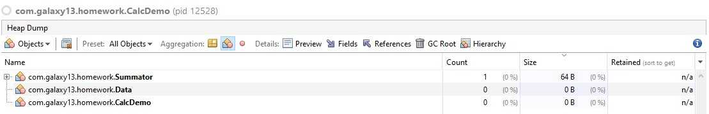

## Результаты оптимизации GC

1. Согласно условию домашней работы, для предоставленной программы (без изменений исходного кода) тестовым путём был
   определён оптимальный размер **heap**, обеспечивающий минимальную _latency_,
   быструю работы фаз GC и медиального использования памяти кучи. Результаты запусков для неоптимизимированного кода:

| Тип GC      | # запуска | Max heap, MB | Время, ms | # GC Young | Max освобождённый хип, MB |
|-------------|-----------|--------------|-----------|------------|---------------------------|
| G1          | 1         | 256          | 29741     | 506        | 155                       |
|             | 2         | 2048         | 26608     | 63         | 1229                      |
|             | 3         | 1024         | 29532     | 125        | 615                       |
|             | 4         | 1536         | 27222     | 84         | 922                       |
|             | 5         | 1280         | 27673     | 100        | 769                       |
|             | 6         | 1152         | 27803     | 111        | 693                       |
| Parallel GC | 1         | 256          | 23826     | 998        | 82                        |
|             | 2         | 2048         | 15186     | 116        | 678                       |
|             | 3         | 1024         | 16173     | 231        | 336                       |
|             | 4         | 512          | 18534     | 471        | 167                       |
|             | 5         | 768          | 16683     | 309        | 252                       |
|             | 6         | 640          | 17663     | 374        | 210                       |

Так как задача требует быстрого выполнения программы (_throughput_) и минимально возможного
использования памяти (_memory_) оптимально использовать ParallelGC, так как инкрементальный подход к обеспечению
минимальных задержек, увеличивает время исполнения.

Соответственно, дял первоначальной версии программы, оптимальные размеры хипа:

- G1GC: 1280m
- ParallelGC: 768m

2. Оптимизация CalcDemo.

Основная проблема первоначальной версии программы - частый вызов GC на преобразование Young пространства, ввиду того,
что
на каждый вызов расчёта _Summator_, jvm аллоцирует пространство для объекта _Data_ c ссылкой на новый объект
Integer. A также класс _Summator_ содержит поля, состоящие из ссылок на объекты _Integer_. Так как программа
не использует методы класса _Integer_ и содержание в хипе целочисленных значений не имеет причины, более логично
содержать
эти значения на стеке. Для этого класс _Integer_ заменён на тип _int_. (также меняется в возвращаемых типах,
для исключения скрытого приведения)

Исходя из логики программы, поле List используется только в качестве счётчика количества объектов.
Поэтому его логичнее заменить на _int_ счётчик, который также будет обнуляться в случаях достижения определённого
значения.

Остальные изменения оказывают незначительное влияние на время работы программы:

- однократный вызов *data.getValue()* и использование значения из переменной
- однократный расчёт слагаемого *someValue* (вместо 3)

Отдельно стоит отметить оптимизацию, связанную с использованием одного экземпляра Data и изменение его данных
инкрементально,
вместо создания нового объекта Data при каждом расчёте.

Данная картина, а именно отсутствие объектов класса Data в хипе, как с оптимизацией, так и без неё, указывает на то, что
в код программы вносятся дополнительные изменения во время runtime c помощью JIT. Косвенно подтверждается это логами
JIT-компиляции:
195 572 3 com.galaxy13.homework.Summator::calc (132 bytes)
195 571 3 com.galaxy13.homework.Data::<init> (10 bytes)
195 496 3 java.io.DataInputStream::readFully (59 bytes)   made not entrant
195 570 1 com.galaxy13.homework.Data::getValue (5 bytes)
195 573 4 com.galaxy13.homework.Summator::calc (132 bytes)
195 574 4 com.galaxy13.homework.Data::<init> (10 bytes)
196 571 3 com.galaxy13.homework.Data::<init> (10 bytes)   made not entrant

Данные логи указывают на то, что при оптимизации компилятором full С1 метода _Summator::calc_, происходит
оптимизация simple C1 метода _Data::getValue_.
Для варианта с инкрементом данных:
169 517 3 com.galaxy13.homework.Summator::calc (132 bytes)
169 518 3 com.galaxy13.homework.Data::increment (11 bytes)
169 516 1 com.galaxy13.homework.Data::getValue (5 bytes)
169 519 4 com.galaxy13.homework.Data::increment (11 bytes)
169 520 4 com.galaxy13.homework.Summator::calc (132 bytes)
В данном варианте JIT вносит оптимизации компилятора С2 для функции _Data::increment_. Исходя из этого, можно
предположить,
что JIT "инлайнит" класс, и работает со значениями на стеке. Поэтому для этой программы, оптимизация "1 экземпляра" не
оказывает
влияния ни на размер используемого хипа, ни время исполнения.

Потребление памяти после внесения выше указанных изменений, падает до значений ~20MB. Соответственно размер хипа можно
определить таким
образом, чтобы
GC не вызывался ни разу. Однако, на таких небольших объёмах кучи, процесс очистки оказывает малое влияние на время
исполнения
программы. Оптимальное значение для обоих методов сборки мусора (выявлено тестово) является *~3MB*. При дальнейшем
уменьшении
размера хипа:

- ParallelGC: резкое увеличение времени работы (из-за огромного # вызовов Full GC)
- G1GC: с меньшим объёмом не запускается (возможен тюнинг размера Young, однако данная опция experimental)

| Тип GC     | # запуска | Max heap, MB | Время, ms | # GC Young | #GC Full | Макс освобожденный хип, MB |
|------------|-----------|--------------|-----------|------------|----------|----------------------------|
| ParallelGC | 1         | 64           | 3642      | 0          | 0        | 0                          |
|            | 2         | 32           | 3520      | 1          | 0        | 9                          |
|            | 3         | 16           | 3614      | 3          | 0        | 5                          |
|            | 4         | 8            | 3580      | 10         | 0        | 3                          |
|            | 5         | 4            | 3610      | 26         | 0        | 2                          |
|            | 6         | 2            | 4794      | 4          | 126      | 1                          |
|            | 7         | 3            | 3619      | 26         | 0        | 2                          |
| G1GC       | 1         | 64           | 3614      | 0          | 0        | 0                          |
|            | 2         | 32           | 3630      | 0          | 0        | 0                          |
|            | 3         | 16           | 3609      | 1          | 0        | 9                          |
|            | 4         | 8            | 3614      | 6          | 0        | 3                          |
|            | 5         | 4            | 3659      | 7          | 6        | 2                          |
|            | 6         | 3            | 3697      | 10         | 5        | 2                          |